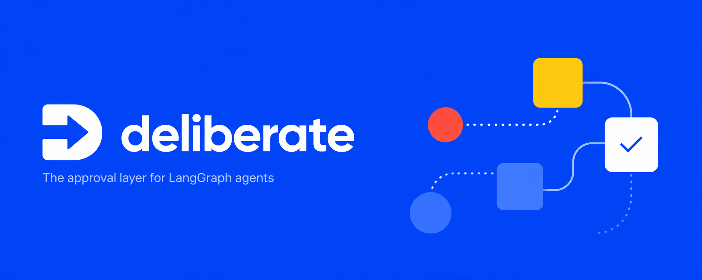
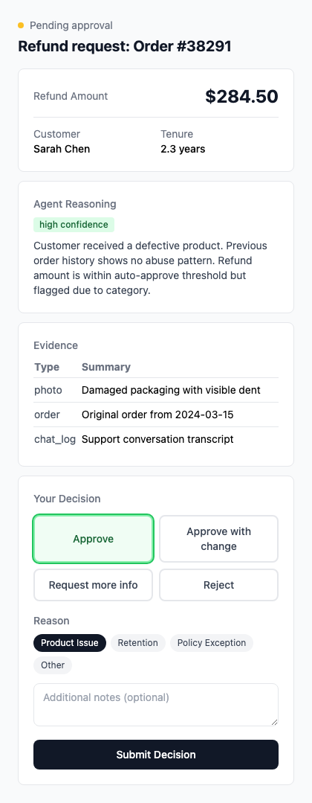
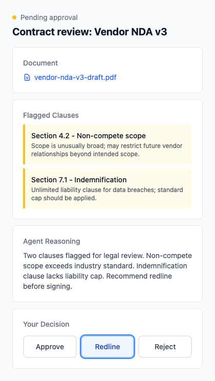
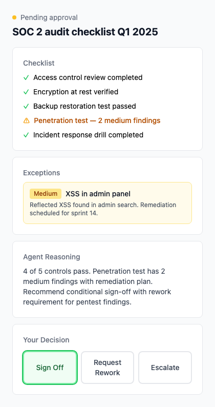
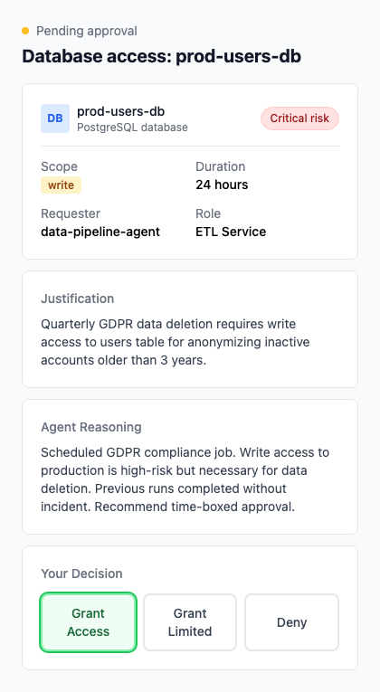
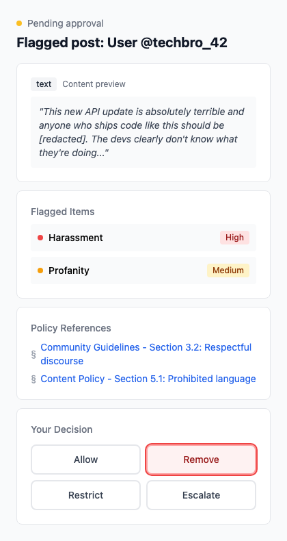
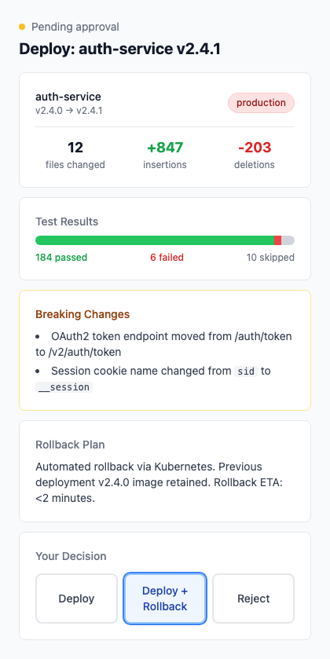

<div align="center">

<!-- Logo placeholder -->


### The approval layer for LangGraph agents

[**Live demo**](https://deliberate.dev/demo) · [**Docs**](https://deliberate.dev/docs) · [**Discord**](https://discord.gg/deliberate) · [**Report a bug**](https://github.com/your-handle/deliberate/issues)


Your LangGraph agent calls `interrupt()`. Now what?

Deliberate turns it into an approval request a non-engineer can actually answer — with notifications, timeouts, structured audit trails, and UIs built for the people who actually sign off.


</div>

---

## The gap LangGraph leaves open

LangGraph made `interrupt()` a first-class primitive. That solved the *runtime* half of human-in-the-loop — the graph pauses, state is checkpointed, and execution resumes with `Command(resume=...)`.

The *organizational* half is still yours to build:

- **Nobody gets notified.** The thread sits in the checkpointer. If your approver isn't watching the terminal, they don't know you're waiting on them.
- **Nothing times out.** A graph paused 3 weeks ago is indistinguishable from one paused 30 seconds ago.
- **There's no audit log.** State is persisted, but *who* decided, *when*, *why*, *with what context* — that record doesn't exist unless you build it.
- **Your approver is probably not an engineer.** But the only interface LangGraph gives them is your Python REPL.

Deliberate fills that gap — everything between *your agent paused* and *your agent resumes*.

---

## See it in 90 seconds

<div align="center">
<a href="https://deliberate.dev/watch-demo">

</a>
</div>

Or try it yourself → **[deliberate.dev/demo](https://deliberate.dev/demo)** (no signup, resets every hour)

---

## Quickstart

**1. Run Deliberate**

```bash
git clone https://github.com/your-handle/deliberate.git
cd deliberate
docker compose up
```

Deliberate is running on `http://localhost:4000`.

**2. Install the SDK**

```bash
pip install deliberate
```

**3. Wrap your LangGraph node**

```python
from deliberate import approval_gate
from langgraph.types import interrupt

@approval_gate(
    layout="financial_decision",
    notify=["email:finance@acme.com", "slack:#finance-approvals"],
    policy="policies/refund.yaml",
)
def process_refund(state):
    return interrupt({
        "customer": state.customer,
        "amount": state.amount,
        "agent_reasoning": state.reasoning,
        "evidence": state.evidence,
    })
```

That's it. When the graph reaches this node, Deliberate routes the approval, notifies the right person, and waits — then hands the decision back to your graph.

See the [full quickstart](https://deliberate.dev/docs/quickstart) or grab a [working example](./examples/refund_agent).

---

## Built-in layouts for HITL-critical domains

Different decisions need different information architecture. A finance lead approving a refund doesn't need the same layout as a legal reviewer redlining a contract. Deliberate ships with layouts tuned for the domains where HITL matters most.

<table>
<tr>
<td width="33%">

### `financial_decision`
For refunds, expense approvals, budget requests. Leads with amount and evidence.



</td>
<td width="33%">

### `document_review`
For contracts, policies, legal redlines. Leads with the document and flagged clauses.



</td>
<td width="33%">

### `procedure_signoff`
For audit steps, compliance checks, quality gates. Leads with checklist and exceptions.



</td>
</tr>
<tr>
<td width="33%">

### `data_access`
For sensitive data access, export approvals. Shows who, what, why, and retention.



</td>
<td width="33%">

### `content_moderation`
For generated-content review, publish approvals. Leads with the content and flags.



</td>
<td width="33%">

### `code_deployment`
For automated deploys and infra changes. Leads with diff and blast radius.



</td>
</tr>
</table>

Need something else? [Build a custom layout](./docs/custom-layouts.md) — layouts are just React components that consume a typed payload schema.

---

## Everything else

- **📬 Multi-channel notifications** — Slack, Email, or Webhook. Pick one, or fan out to all three. ([docs](https://deliberate.dev/docs/notifications))
- **⏱ Timeouts and escalation** — Approver didn't respond in 4h? Auto-escalate to the backup or fail gracefully. ([docs](https://deliberate.dev/docs/timeouts))
- **📋 YAML policy routing** — Declare who approves what based on payload. Auto-approve small amounts, require two sign-offs for big ones. ([docs](https://deliberate.dev/docs/policies))
- **🗂 Audit ledger** — Every decision structured and exportable. Who, when, why, with what context. ([docs](https://deliberate.dev/docs/ledger))
- **📱 Mobile-first approver UI** — Because your finance lead approves from their phone in meetings. ([docs](https://deliberate.dev/docs/approver-ui))
- **🔌 LangGraph native** — Built directly on `interrupt()` and `Command(resume=...)`. No adapters, no abstractions to learn. ([docs](https://deliberate.dev/docs/langgraph))

---

## How it works

<div align="center">

</div>

When your LangGraph agent calls `interrupt()` inside a `@approval_gate`-decorated node:

1. The SDK captures the payload and posts it to Deliberate's server.
2. Deliberate evaluates your YAML policy to resolve approvers, timeout, and escalation rules.
3. Notifications fire to the configured channels (Slack/Email/Webhook) with a signed approval link.
4. The approver opens the link, sees the layout you configured, and submits a structured decision.
5. Deliberate writes the decision to the ledger and calls `Command(resume=decision)` on your graph.
6. Your agent picks up exactly where it paused.

The graph state lives in LangGraph's checkpointer. The approval state, audit trail, and policy evaluation live in Deliberate's Postgres. The two stay synchronized through the LangGraph thread ID.

---

## Relationship to LangGraph

Deliberate isn't a replacement for LangGraph's HITL primitives — it builds on them.

LangGraph gives you `interrupt()`, `Command(resume=...)`, and a checkpointer. That's the low-level runtime, and it's excellent. What LangGraph deliberately doesn't ship (by design, since every team's notification stack and audit requirements are different) is the layer that turns an interrupted thread into an actual request a human sees, responds to, and leaves a record of.

That layer is Deliberate. Use LangGraph's `interrupt()` anywhere — Deliberate only kicks in when you wrap a node with `@approval_gate`. Mix and match as you like.

---

## Project status

Deliberate is at **v1.0**. The core flow (SDK → server → notifications → approval UI → resume → ledger) works end-to-end. Self-hosting is supported. Managed cloud is not yet available.

### Shipped

- ✅ LangGraph SDK with `@approval_gate` decorator
- ✅ Slack, Email, and Webhook notifications
- ✅ YAML policy routing (conditional approvers, timeouts, escalation)
- ✅ Multi-approver support (`any_of` / `all_of` modes)
- ✅ 6 built-in layouts: `financial_decision`, `document_review`, `procedure_signoff`, `data_access`, `content_moderation`, `code_deployment`
- ✅ [Custom layout SDK](./docs/custom-layouts.md) — build your own layouts as React components
- ✅ Append-only audit ledger with hash chain integrity, JSON/CSV export
- ✅ OTLP export (feeds into Langfuse, Phoenix, or any OTLP-compatible collector)
- ✅ Signed JWT approval URLs with HKDF key derivation
- ✅ Magic link approver identity verification
- ✅ Prometheus metrics (`/metrics` endpoint)
- ✅ Timeout worker with escalation depth guard
- ✅ Unified audit view (decided approvals show layout + decision record)
- ✅ Docker Compose self-hosting

### Documentation

- [Quickstart Guide](./docs/quickstart.md) — 15-minute install-to-first-approval
- [Custom Layouts](./docs/custom-layouts.md) — build your own approval layouts
- [Security & Threat Model](./docs/security.md) — STRIDE analysis, key management, production recommendations
- [Contributing](./CONTRIBUTING.md) — development setup and PR process

### Not planned (for now)

- ❌ Support for non-LangGraph agent frameworks. Our goal is to be the best approval layer for LangGraph specifically.
- ❌ BPMN-style multi-step workflows. If you need this, check out Camunda or Temporal.

See the [full roadmap](https://deliberate.dev/roadmap) and [vote on ideas](https://github.com/your-handle/deliberate/discussions/categories/ideas).

---

## Related projects

Deliberate sits on top of — and alongside — great tooling from the LangGraph and agent observability communities.

- **[LangGraph](https://github.com/langchain-ai/langgraph)** — the agent runtime Deliberate builds on.
- **[Langfuse](https://github.com/langfuse/langfuse)** — LLM observability and tracing. Complementary: Langfuse records *what the agent did*; Deliberate records *what the human decided*.
- **[OpenTelemetry GenAI conventions](https://opentelemetry.io/docs/specs/semconv/gen-ai/)** — the spec we align ledger exports to.
- **[Permit.io](https://github.com/permitio/permit-node)** — authorization-as-a-service with some HITL overlap; stronger fit when access control is the primary concern.

If you're building in this space, open a PR and we'll add you here.

---

## Contributing

We welcome contributions. Start here:

- 💬 [Join the Discord](https://discord.gg/deliberate) to ask questions or share what you're building
- 🗳 [Vote on ideas](https://github.com/your-handle/deliberate/discussions/categories/ideas) on GitHub Discussions
- 🐛 [Report bugs](https://github.com/your-handle/deliberate/issues)
- 🔧 [Read CONTRIBUTING.md](./CONTRIBUTING.md) to set up a dev environment

Good first issues are tagged [`good-first-issue`](https://github.com/your-handle/deliberate/issues?q=is%3Aissue+label%3Agood-first-issue).

---

## License

MIT. See [LICENSE](./LICENSE).

---

<div align="center">

Built by [Beomwoo Kang](https://github.com/your-handle). For questions about using Deliberate in production or at scale, reach out: `beomwookang@gmail.com`.

⭐ [Star us on GitHub](https://github.com/your-handle/deliberate) if Deliberate makes your agents less painful to run.

</div>
